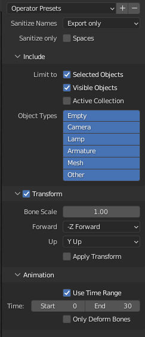

import { Steps } from '@astrojs/starlight/components';

It is possible to create or import custom animations for your models so they doesn't look stiff in-game. This can be achieved by using **Track Studio**, a tool developed originally for **Mario Kart 8 Deluxe** modding, but that can be used for **Animal Crossing: New Horizons** as well. 

#### Prerequisites
- [Track Studio](https://github.com/MapStudioProject/Track-Studio)
- A model with a rig

### Preparing the Model
To create an animation for your model in Blender, you'll first need to export it as a `.dae` file. 

To do this, open your model in the Track Studio, expand `Models` and right-click the model you want to animate, then click on `Export`.

### Exporting Animations from Blender
To export animations from Blender, you'll need [this plugin](https://github.com/PositionWizard/Blender_io-scene-ANIM/releases) that adds support for exporting `.anim` files, the format used by Track Studio.
**This plugin works better on Blender 3.6**, which is the version they developed it on. 

<Steps>
1. In Blender, import the `.dae` file of your model
2. Import or create a new animation for your model
3. Once you have your animation ready, go to `File` > `Export` > `Maya Animation (.anim)`.
4. You can use these settings for the export:

</Steps>

### Importing Animations to Track Studio
To import the exported `.anim` file into Track Studio, follow these steps:
<Steps>
1. In Track Studio, right-click on the `Animations` folder and click on `New Skeletal Animation`.

2. This will create an empty animation, right-click on it and use `Replace` to import your `.anim` file.

3. Preview the animation in the `Animation Graph` tab, if everything looks good, you can save your model.
</Steps>

#### More resources
You can consult the official documentation for more information about this topic:
- [Track Studio Documentation](https://mapstudioproject.github.io/TrackStudioDocs/bfres/SkeletalAnim.html)

*Shutout to @Spooner for discovering that it is possible to use Track Studio for ACNH!*