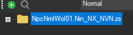
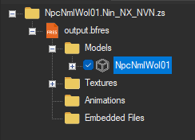

import { LinkCard, Tabs, TabItem, Steps, FileTree } from '@astrojs/starlight/components';

In this guide we'll be covering the steps for editing a Villager model. This can be later used to add a new villager to the game.

## Prerequisites
- [A dump of your game files](/guides/dumping-romfs)
- Switch Toolbox
- Blender *(for model editing)*
- A program to edit textures *(e.g. `GIMP`, `Photoshop`, etc)*
- Heaven Tool
- MSBT Editor

:::caution
This guide assumes you already know the basics of Blender and Model/Texture editing. It will just cover the specific steps needed for ACNH modding.
:::

## Exporting Model
<Steps>
    1. In your dumped `romfs`, locate the `Model` folder and a reference Vilager Model of your choice (they start with `NpcNml`);

        *There is a [list](https://animalcrossing.fandom.com/wiki/List_of_villagers_by_internal_name_(New_Horizons)) with all Villager identifiers*

    2. Copy and move the Vilager of your choice into a new folder, just to backup and have a easy way of finding it again.

    3. Load the Villager into **Switch Toolbox**, it will be loaded as folder.

          
    4. Expand it by clicking on the small `+` button next to the folder name, do the same for `output.bfres` and `Models`.

        *It should look like this:*
          

    5. Right-click the Model inside `Models` and export it as a `.dae` to a folder of your choice.
</Steps>

## Editing with Blender
<Steps>
    1. Open your Blender and import your model (`File` > `Import` > `Collada (.dae) (Legacy)`)

        *Blender may remove `.dae` support in the future (**Blender 5.0**), at the time of writing **Blender 4.5.0** still have this option, as do older versions.*
    
    2. You can now do *almost* whatever you want to the Model. But it is important to keep in mind:
        
        - Keep everything low poly, specially if you're making a entire new model.
        - When creating accessories or something to extend the Villager, make sure to keep it joined to some part of the body (`Ctrl + J`).
        - Keep the name of body parts intact. For example: `Body__mBody`.
        - New parts you create need to be **weight painted**.
        - Keep one material per body part.
         
    
    3. When you're done with Blender editing, export it as `.dae` again.
</Steps>

## Texture Editing
<Steps>
    1. In **Switch Toolbox**, right-click the `Textures` folder inside `output.bfres` and hit `Export All Textures`.

        **Make sure to select a empty folder for your textures.**

    2. You can edit textures with any program of your choice. E.g. *Photoshop*, *GIMP* or even *Substance Painter* if you're looking into complex edits.
    3. If you end up with bright textures in-game, try lowering the opacity of your `Alb` textures (something around 32%). 
    4. In Switch Toolbox, right-click the `Textures` folder and hit `Replace Textures (From Folder)`. 

        Select the folder you exported before, but **make sure it only contain the exported textures and nothing more**.
</Steps>

### Normal Map Tips
...

## Importing Model
...

*This guide was originally written by [@CutieSammy](https://gamebanana.com/members/3182432), the original version is available on [GameBanana](https://gamebanana.com/tuts/17215).*