import { LinkCard, Steps, Tabs, TabItem, FileTree } from '@astrojs/starlight/components';

An open-source tool created by [@kwsch](https://github.com/kwsch) and berichan. NHSE is a New Horizons Save Editor that will allow you to edit a lot of things pertaining to your island, including changing villagers, map editing, adding items, changing your name etc etc.
> GitHub: [kwsch/NSHE](https://github.com/kwsch/NHSE)

:::caution
    This is a working-in-progress page. More info will be added in the future.
:::

---
You can download the latest version here: **[Get NHSE](https://berichan.github.io/GetNHSE/)**

### Compatible File Types
See [Dumping Save Data](/guides/dumping-save-data).

### Expected Structure
<FileTree>
- acnh_tools/
  - **NHSE/**
    - bak/ # auto-generated if you set up save backups
      - **`IslandName - 2026-05-20 17.28.21/`** # Save Folder backup
        - ... # See **Compatible File Types** for file structure
    - LibUsbDotNet.LibUsbDotNet.dll
    - NHSE.Core.dll
    - NHSE.Core.pdb
    - NHSE.Injection.dll
    - NHSE.Injection.pdb
    - NHSE.Sprites.dll
    - NHSE.Sprites.pdb
    - NHSE.Villagers.dll
    - NHSE.Villagers.pdb
    - NHSE.WinForms.deps.json
    - NHSE.WinForms.dll
    - **NHSE.WinForms.exe** # Main executable
    - NHSE.WinForms.pdb
    - NHSE.WinForms.runtimeconfig.json
    - settings.json # auto-generated after running
</FileTree>

## Windows Setup
<Steps>
    1. Download the latest version of **NHSE.**
    2. Extract the downloaded archive to a folder on your computer.
        - See **Expected Structure** for file structure
    3. Open the extracted folder and run `NHSE.Winforms.exe`
    4. Once the tool is open, click `Open main.dat Or... Drag & Drop folder here!`
        :::tip
          You can also click and drag your `main.dat` file instead to open your save. Check **Compatible File Types** to see what a save folder may look like.
        :::
    5. You can now edit your Save! When you're done, save your edited files and test in-game!
</Steps>

## Linux-specific Setup
NHSE is Windows software, so we have some additional one-time steps to get it to work on Linux.

*This guide was originally written by [@Comfy_Deer](https://gamebanana.com/members/2939561)*
- Feel free to ask questions in the ACNH Modding Hub Fluxer Community if you get stuck somewhere along the process. -🦌

### Lutris Installation
<Steps>
    1. Go to Discover (or whatever "store" your Distro has)
    2. Search for Lutris and install the Flatpak version (It's Flatpak by default on Steam Deck in Discover)
    3. [Get NHSE](https://berichan.github.io/GetNHSE/), of course (Click on `Download Latest NHSE Version`. Build no. 9008+ should be what is compatible with v3.0.0)
    4. Extract your NHSE zip file wherever you want it to live.
        - I have several folders set up, and I have mine located at `/home/deck/Documents/Nintendo Homebrew/Nintendo Switch RCM Tools/Switch Modding Tools/acnh_tools/NHSE`
        - See **Expected Structure** for file structure
    5. Once we're fully installed, let's open up Lutris (If you just opened for the first time, give it a short amount of time to install dependencies)
</Steps>

### NHSE Lutris Setup
<Tabs>
    <TabItem label="Steps 1-3">
        <Steps>
            1. Go to the top left corner and click the `+` next to the Lutris logo.
            2. Next, we'll want to **Add locally installed game**
                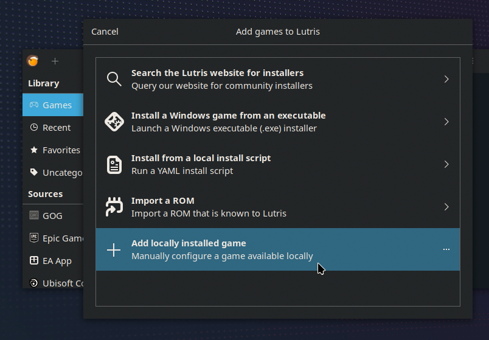
            3. Set up the **Game info** tab. At most you'll need to **name the app** like `NHSE` and **Set the Runner** to **Wine.**
                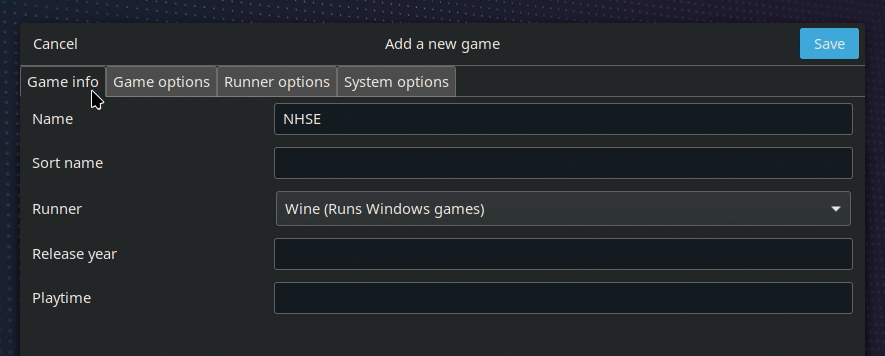
        </Steps>
    </TabItem>

    <TabItem label="Step 4">
        <Steps>
            4. In **Game Options,** we'll want to **link the app.**
                :::note
                For some reason on SteamOS/KDE, it won't allow us to use the `...` menu. So we'll have to **copy the location and paste** it in instead.
                :::
                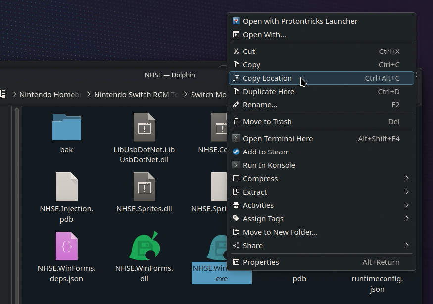
                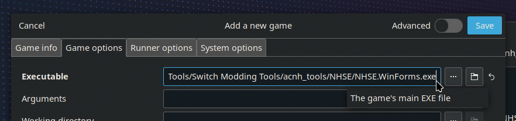
        </Steps>
    </TabItem>

    <TabItem label="Steps 5-6">
        <Steps>
            5. **Set up the prefix location.** We can actually use the `...` menu for this one. Create a new folder for your prefix.
            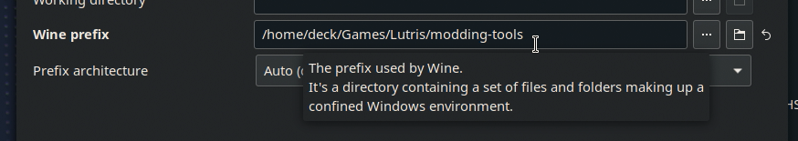
                :::tip
                I recommend naming the prefix to something like "modding-tools" or something that helps you remember its purpose.
                <FileTree>
                - home/
                    - deck/ # ~/
                    - Games/ # May be auto-generated by Lutris
                        - Lutris/ # Self-created for organizing Lutris prefixes, otherwise saves to Games directory
                        - **modding-tools/** # Prefix location
                </FileTree>
                Example: My folder is located at `/home/deck/Games/Lutris/modding-tools`
                :::
            6. Let's also **set the Wine version** to **System,** otherwise, we might run into some issues of it not booting. When you're finished with the setup, click Save!
                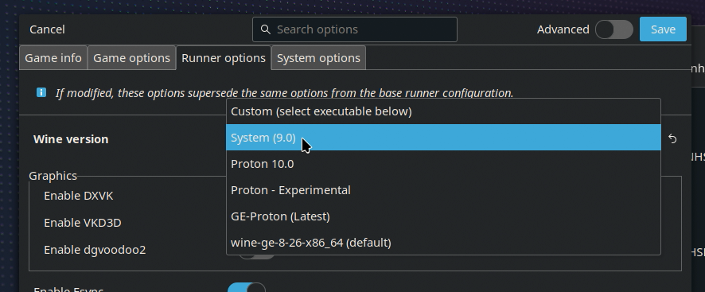
        </Steps>
        :::caution
        We can now run, right? Weeeeell... this is why I made this tutorial. Since it's not as shrimple as that, unfortunately. 🦐
        :::
    </TabItem>
</Tabs>

### WinForms Lutris Setup
<Tabs>
    <TabItem label="Steps 1-2">
        <Steps>
            1. You will probably get this error.
                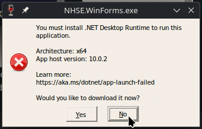
                - We're going to say No (I've tested and Yes doesn't really do anything)
            2. Look up that specific version online and download it. Make sure it's the Windows Desktop Runtime being downloaded. Luckily, that only has the type to choose from.
                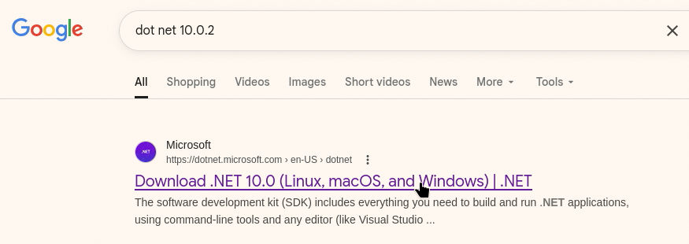
                :::note
                Assuming you have an x64 based computer such as the Steam Deck, pick x64
                :::
                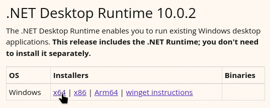
        </Steps>
    </TabItem>

    <TabItem label="Steps 3-4">
        <Steps>
            3. Right click on your NHSE entry and go to Configure
                :::tip
                Alternatively, you can access this in the menu next to the Play button
                :::
                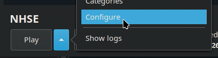
            4. Go to wherever your download of Windows Desktop Runtime went. We'll have to temporarily replace the configuration so we can install it in the prefix.
                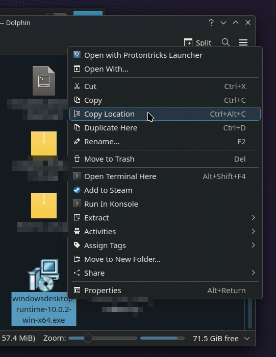
        </Steps>
    </TabItem>

    <TabItem label="Steps 5-6">
        <Steps>
            5. We'll have to temporarily replace the configuration so we can install it in the prefix.
                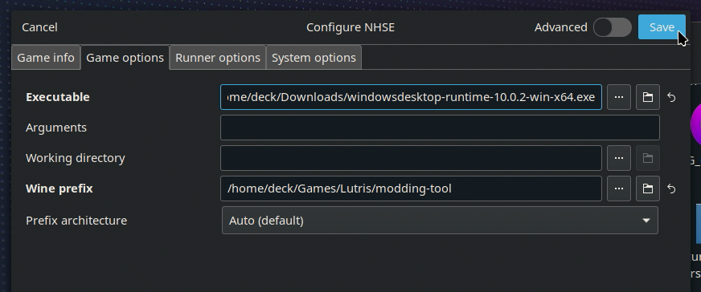
            6. Run "NHSE", which should now open the Windows Runtime Installer since we replaced that with it. Follow the prompts to install the Desktop Runtime to the prefix.
                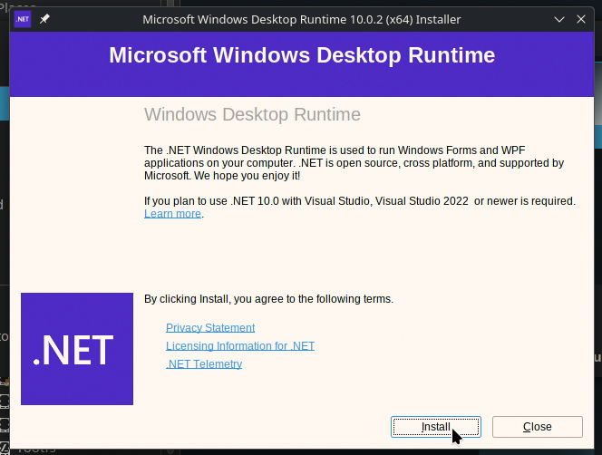
        </Steps>
    </TabItem>

    <TabItem label="Steps 7-8">
        <Steps>
            7. Once installed, we should now configure once again to link back to NHSE's executable.
                :::tip
                On SteamOS, KDE has a handy clipboard that saves what you've copied so far, so you can single click to copy your previous location.
                :::
                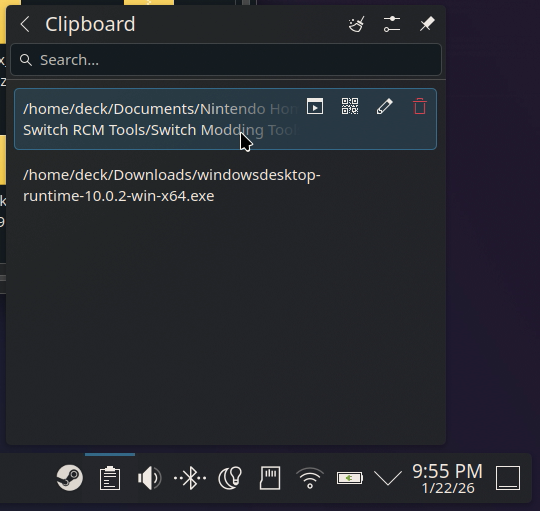
                
            8. Now we can run! You should now see NHSE show up. Hurray! **We're almost done.**
        </Steps>
    </TabItem>
</Tabs>

### Running NHSE
<Steps>
    1. Next, we want to open a save file. If you're running something like Eden, go to your save data location and go up a folder. Then for easy access, click and drag to Copy Here or Link Here for your save file on the Desktop.
    2. On NHSE, click to open the file prompt. If you copied/linked your save file when this window was already open, hit F5 to refresh. Then go to your folder and open main.dat
        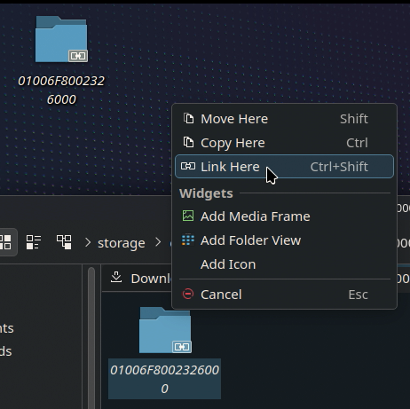
    3. You'll be asked if you want saves to be backed up. I recommend hitting Yes.
        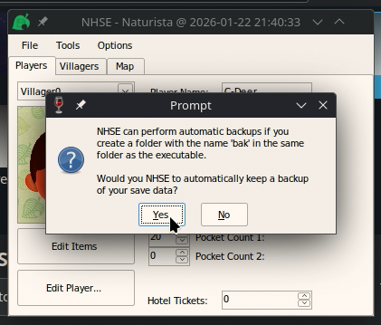
        - **And one Last thing!! This is important.** If you click on the buttons like Edit Player..., you might notice the app crashing.
    4. We'll have to go to winecfg and change the Windows type to Windows 8.1. I don't know why it's unstable on Wine's Windows 10.
        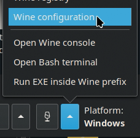
        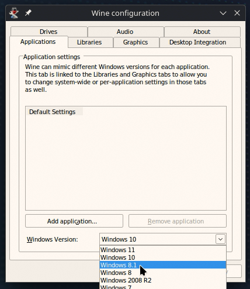
        - But... if you now re-run NHSE with this new config... **You should now be able to save edit. Hurray!**
</Steps>

Have fun save editing ACNH on your Steam Deck or Linux PC!